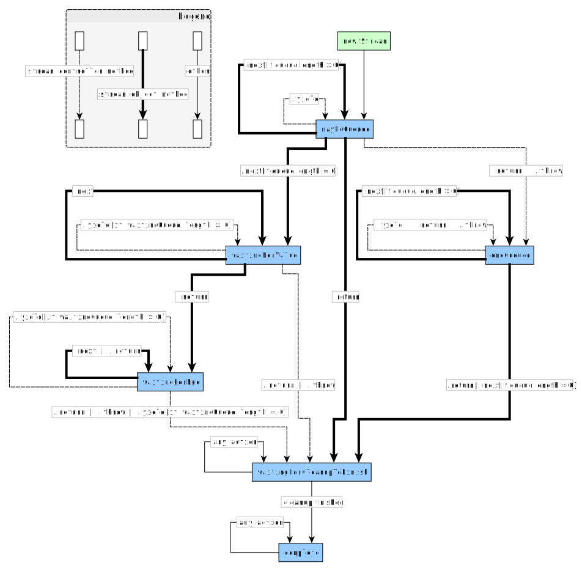

# Stream

### Introduction

The JavaScript language now has [async iterators and async generators](https://jakearchibald.com/2017/async-iterators-and-generators/), however not included is a way to create async iterators from existing data sources.

This library is designed to fill that void by providing a single concrete type with a lot of similarities to the Promise type. It also borrows ideas from the [observable proposal](https://github.com/tc39/proposal-observable) and allows any observer to also be used as the first argument to `Stream`.

*NOTE: Like the Observable proposal the goal of Stream is to have minimal API surface which is why Stream does't include any operators such as `.map`/`.filter`/etc, those should provided by some other library*

### Examples

```js
const interval = new Stream(stream => {
    setInterval(stream.yield, 1000)
})

for await (const _ of interval) {
    console.log("Tick")
}
```

```js
function mediaChunks(mediaRecorder, stopWhen) {
    return new Stream(stream => {
        mediaRecorder.ondataavailable = ({ data }) => stream.yield(data)
        stopWhen(stream.return)
    })
}

const userVoice = await navigator.mediaDevices.getUserMedia({ audio: true })
const stopWhen = callback => setTimeout(stopWhen, 10000)

const recorder = new MediaRecorder(userVoice)

for await (const chunk of mediaChunks(recorder, stopWhen)) {
    // Even if db.append is slow the rest of the chunks will still be queued
    await db.table(filename).append(chunk)
}
```

### API

#### `new Stream(initializer, { queue=new Queue() }={})`

The `Stream` constructor requires a single paramater as it's first argument, the initializer will be called
immediately a `StreamController` object, it may optionally return a single function that will be called
when cleanup is started and the stream is complete.

Optionally as a second argument an options bag may be provided. At current the only available option is `queue`.

##### `StreamOptions.queue`

Optionally you can pass a custom queue object. It needs to conform to the following interface:

```ts
interface AbstractQueue<T> {
    isEmpty: boolean;
    enqueue: (item: T) => any;
    dequeue: () => T;
}
```

The only other invariant on these methods is that that if `.isEmpty` is `true` then until the microtask ends the next call to `.dequeue` **must** return an item. `.dequeue` will never be called if `.isEmpty` is false.

#### `stream.next()`

This is the implementation of `AsyncIterator.next`, if an item is in the queue then it'll return the first item from the queue. Otherwise we'll wait until the next item is available.

*Note*: Multiple calls to `.next`/`.return` are safe even without waiting for the previous one to resolve. The results will always be resolved in order.

#### `stream.return(value?)`

This is the implementation of `AsyncIterator.return`, if a value is passed **and** the queue is not yet complete then that value will be the `value` in the `IteratorResult`.

When calling this method cleanup will be scheduled to happen once all pending calls to `.next` are resolved.

If the cleanup callback returns a promise then this will not resolve until the returned promise is resolved.

*Note:* If the queue still has items they will simply be ignored.

### `StreamController`

The stream controller object is how you put values into the iterator. You can send values, throw an error or end the iterable at any point.

#### `StreamController.yield(value)`/`StreamController.next(value)`

The `.yield` method (and its alias `.next`) put a value in the stream. If there are already calls to `.next` waiting it will be immediately sent to those, otherwise it will enqueue the values in the queue.

#### `StreamController.throw`/`StreamController.error`

The `.throw` method (and its alias `.error`) causes the stream to terminate with an error.

#### `StreamController.return`/`StreamController.complete`

The `.return` method (and its alias `.complete`) will cause the stream to become complete once the final items on the queue are consumed.


### Default Queue

The default queue is a simple FIFO queue with infinite length.


### State Overview

In order for the stream to clean up at an appropriate time every stream object has a current state. These are similar to Promise objects which have `pending`, `fulfilled` and `rejected` states.

Here's the full state diagram. It's just a teensy tiny bit more complicated than the Promise one:



Okay so it's a bit more complicated than the Promise one but it guarantees that all `.next`/`.return` calls will be appropriately fulfilled if they have been requested.

The following table explains precisely what each method does when in each possible state:

<table>
    <thead>
        <td>
        <td><b>maybeQueued</b></td>
        <td><b>endQueued</b></td>
        <td><b>waitingForValue</b></td>
        <td><b>waitingForEnd</b></td>
        <td><b>waitingForCleanupToFinish</b></td>
        <td><b>complete</b></td>
    <tr>
        <td><code>stream.next</code></td>
        <td>
            <p>
                If the <i>itemQueue</i> has items in it resolve with the first item.
            <p>
                Else we'll add this <code>.next</code> onto the <i>waitingQueue</i> and enter the <b>waitingForValue</b> state.
        <td>
            <p>
                If the <i>itemQueue</i> has items in it resolve with the first item.
            <p>
                Else if the <i>completion value</i> is an error then reject with that error.
            <p>
                Else resolve with the <i>completion value</i>.
        <td>
            <p>
                Add this call <code>.next</code> onto the waiting queue.
        <td>
            <p>
                When the stream is complete <i><b>resolve</b></i>

</table>
